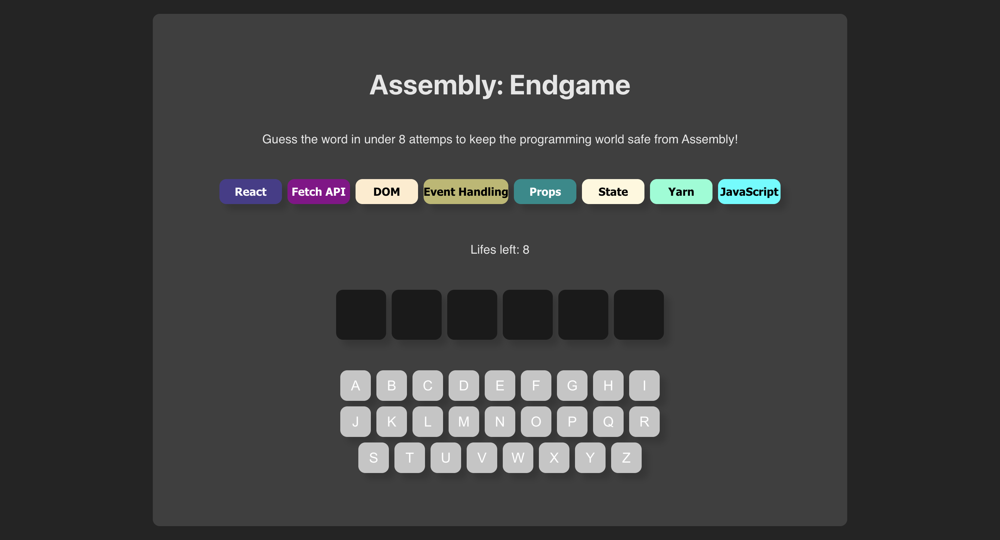

# 🎯 Hangman Game – React Web App

🌐 **Live Site:** [https://assembly-react-endgame.vercel.app/](https://assembly-react-endgame.vercel.app/)


A modern twist on the classic Hangman game, built from scratch using React. This project helped me solidify core React concepts including functional programming, controlled components, data fetching, and side effects.


## 🖼️ Screenshot



## 🚀 Features

- 🎮 Interactive word-guessing gameplay
- ⚛️ Built using React functional components
- ⌨️ Controlled inputs for user interaction
- 🌐 Fetches random words from an API
- 🧠 Clean logic and state management with hooks
- 📱 Responsive design for desktop and mobile

## 🛠️ Tech Stack

- **React** (Hooks, JSX)
- **JavaScript** (ES6+)
- **CSS Modules** or **Styled Components**
- **Fetch API**

## 📦 Installation

```bash
git clone https://github.com/wesleyajavon/assembly-react-endgame
cd assembly-react-endgame
npm install
npm start
